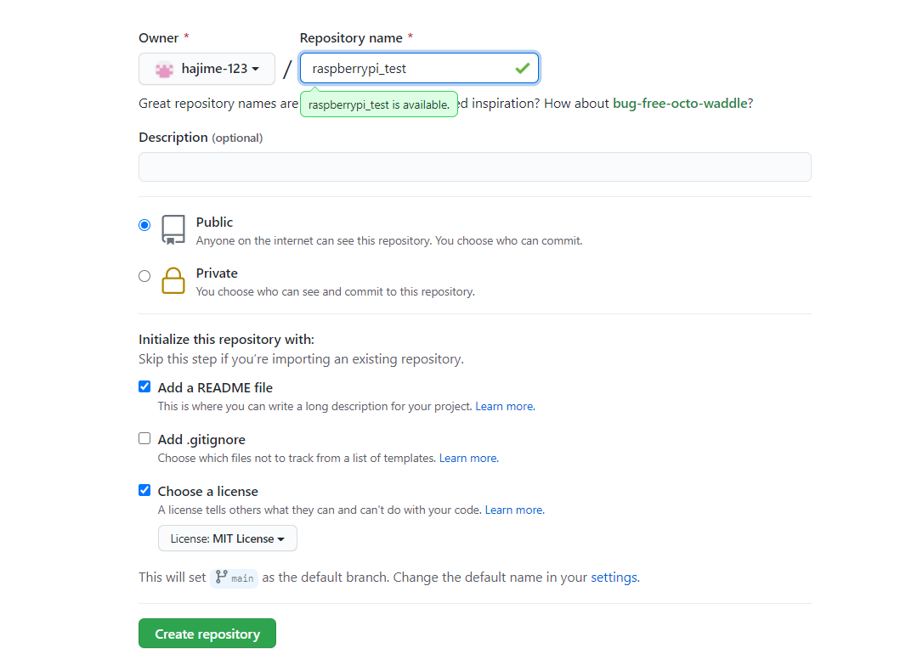

###githubの使い方
まずはrepository作成  

  

以下の設定にする  
  
ローカルレポジトリから　リモートリポジトリへ反映  
~~~  
gitbash上で作業する
cd 保存先の指定 
git clone https://github.com/hajime-123/raspberrypi_test.git 
git add -A
git commit -m "raspi_test"  
git status  
commit間違えたとき
git reset HEAD
OKなら
git push
idとパスワードを求められる  
ローカルレポジトリの情報をリモートレポジトリに反映させる
~~~
リモートリポジトリからローカルリポジトリへ反映
~~~  
ラズパイで作業する
sudo apt install git
git clone https://github.com/hajime-123/raspberrypi_test.git 
~~~  
